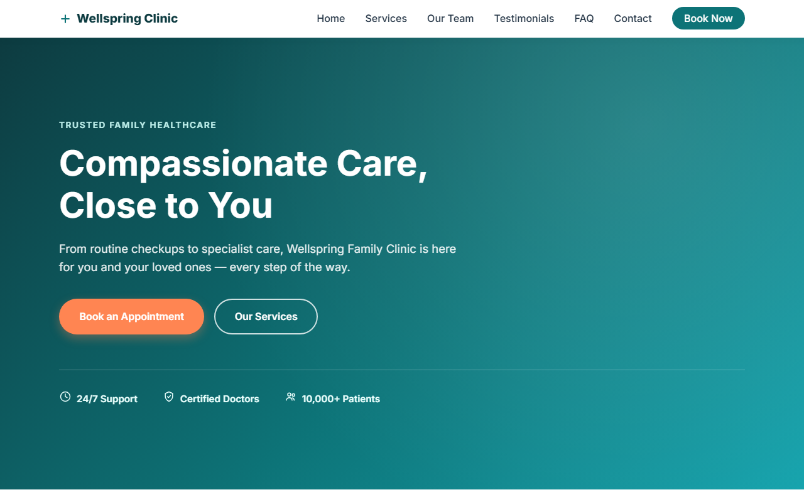

# Wellspring Family Clinic

A static, single-page marketing website for a fictional healthcare clinic. Built with plain HTML, CSS, and JavaScript — no build step, no package manager, no dependencies.

**Live site:** https://adityagupta-sg.github.io/Healthcare2/



## Features

- Responsive, mobile-first layout with a collapsible hamburger nav below 768px
- Custom inline SVG icon set (nav logo, trust badges, service icons) — no emoji icons
- Staggered hero load-in animation and scroll-triggered fade-ins (`IntersectionObserver`), both respecting `prefers-reduced-motion`
- Sections: Hero, How It Works, Services, Meet Our Care Team, Testimonials, FAQ (native accordion), Free New Patient Checklist opt-in, Appointment/Contact form, Footer
- Client-side validated appointment form (name, email, phone) and checklist opt-in form (email), both with inline error messages — no `alert()` popups
- On-page SEO: canonical tag, Open Graph/Twitter cards, `MedicalClinic` + `FAQPage` JSON-LD structured data, `robots.txt`, and `sitemap.xml`

## Tech Stack

- HTML5 (semantic markup)
- CSS3 (Flexbox/Grid, one responsive breakpoint at 768px)
- Vanilla JavaScript (no frameworks)
- Google Fonts ("Inter")

## Project Structure

```
.
├── index.html        # Markup only — links style.css and script.js
├── style.css         # All styling, organized into numbered sections
├── script.js         # Nav toggle, scroll/hero animations, form validation, footer year
├── robots.txt        # Crawler access + sitemap reference
├── sitemap.xml        # XML sitemap for the single page
├── assets/
│   └── screenshot.png   # Site screenshot shown above, captured with Playwright
├── design-system/
│   └── wellspring-family-clinic/MASTER.md   # Design tokens/component reference for this site
└── .github/
    └── workflows/
        └── deploy.yml   # GitHub Actions workflow that deploys to GitHub Pages
```

## Running Locally

There's no build or install step. Just open `index.html` in a browser, or serve the folder with any static file server, e.g.:

```bash
python -m http.server 8000
```

Then visit `http://localhost:8000`.

## Deployment

The site auto-deploys to GitHub Pages via GitHub Actions on every push to `main` (see `.github/workflows/deploy.yml`).

## Notes

Both forms (appointment request and checklist opt-in) validate and log submissions to the browser console — there is no backend yet. Clearly marked spots in `script.js` indicate where real API calls (`fetch('/api/appointments', ...)` and an email service integration) would be wired in.
